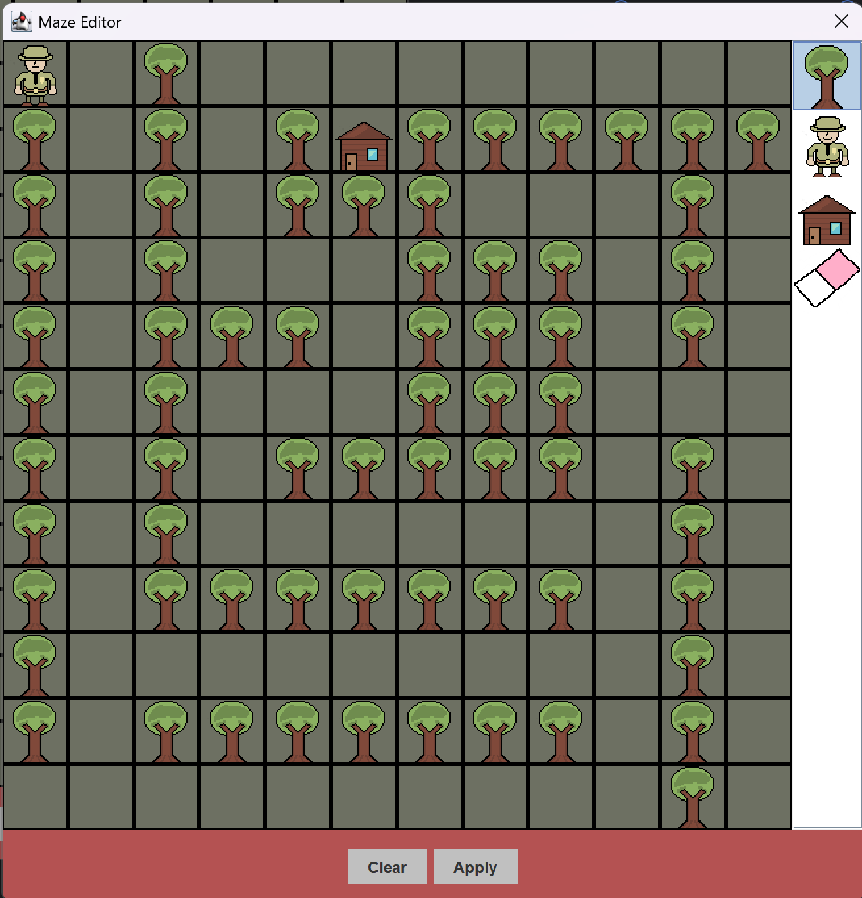
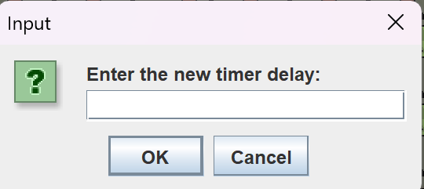
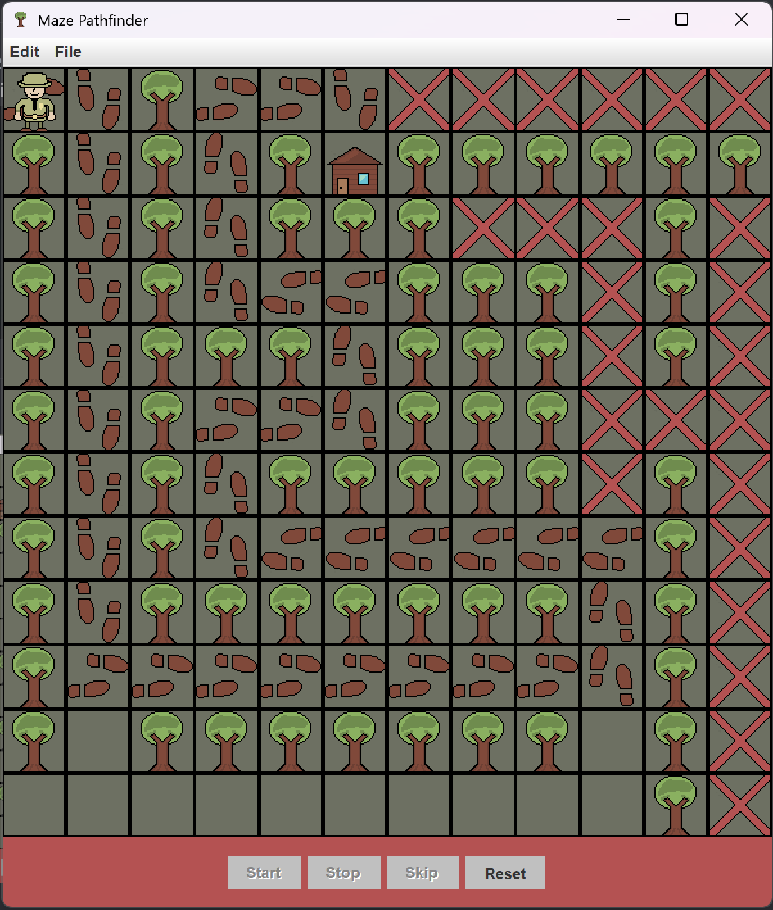

Pathfinder - A GUI Maze Builder and Solver (ICS4U Project)
==========================================
<!-- Insert a gif here -->

Ranger Rick got lost in the woods and needs to look for his cabin!
Luckily, he has a great memory and can remember the paths he takes.
Build a maze with trees and watch as he searches (DFS) for his home! 

Editor
------
To open the editor, use the menubar: Edit > Maze 
 
From here, build any maze you would like! 
It does not have to be solvable, but Ranger Rick will be sad if he cannot find his home.
Note that:
- Right-clicking and double-clicking function as left-clicks
- Only one cabin and Ranger can be placed at a time - they will move

Once your maze is complete: 
 
Press "Apply" to send it to the maze solver.
This will overwrite the maze currently in the maze solver. 
Export any old mazes you wish to keep before pressing Apply.

Solver
------
There are four buttons in the lower panel of the solver:
- Start - Starts the simulation
- Stop - Pauses the simulation
- Skip - Skips one step or tick (Ranger turns or walks)
- Reset - Returns to unsolved state

The speed at which the Ranger moves can be adjusted from Edit > Speed. 
 
The number inputted to the window represents the "timer delay" - that is the time (ms) between ticks of the simulation.

Press start and watch Ranger Rick solve the maze! 
 

Files
-----
The maze file currently loaded in the maze solver can be saved to a .txt file from File > Save.
If you have created a maze in the editor, you must send it to the solver in order to export it.

Alternatively, a previous maze can be loaded in from a .txt file. The specification of a maze file is as follows:
- 'R' for a ranger (only one allowed)
- 'C' for a cabin (only one allowed)
- 'T' for a tree
- '_' for a path
- Dimensions of the maze must be obeyed (8x8 by default)